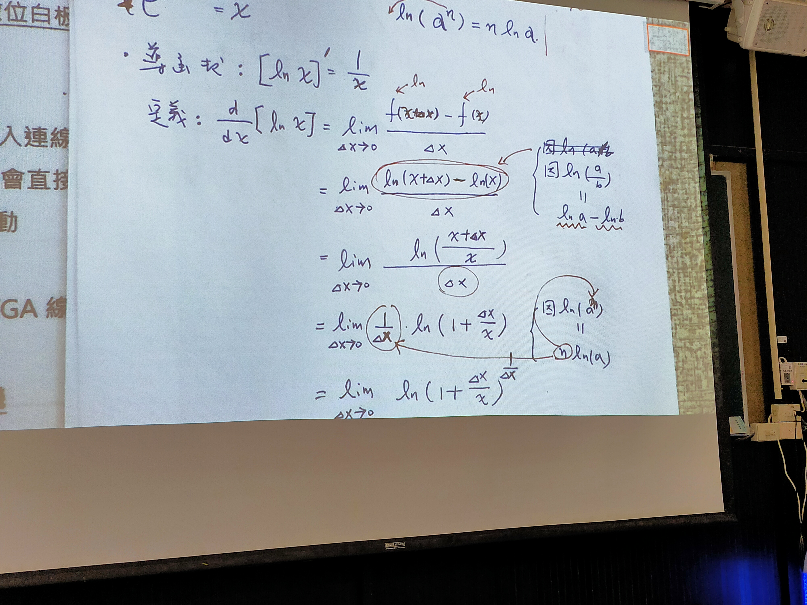
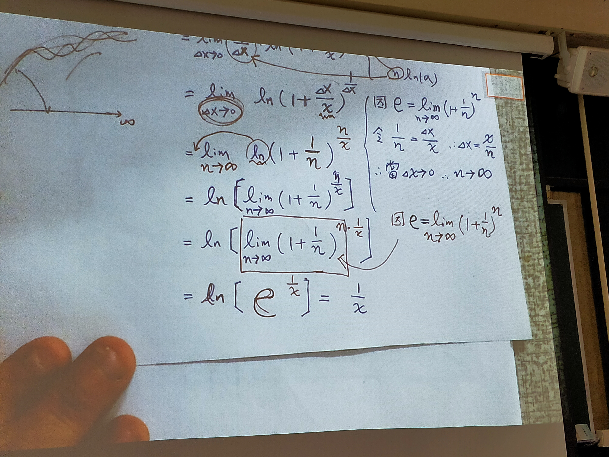
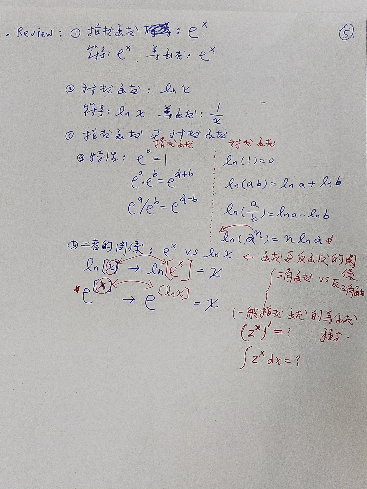

# 5.1對數函數(natural logarthmic function)

---

* 符號

$$\ln x$$

* 特性

$$
\begin{cases}
    \ln 1=0 \\
    \ln (ab)=\ln a+\ln b \\
    \ln \dfrac{a}{b}=\ln a-\ln b \\
    \ln (a^n)=n \ln a
\end{cases}
$$

* 與指數函數的關係：函數、反函數

$$
\begin{cases}
    \ln [e^x]=x \\
    e^{\ln x}=x
\end{cases}
$$

* 導函數

  $$ [\ln x]'=\lim_{\Delta x\to 0} \frac{\ln (x+\Delta x)-\ln x}{\Delta x}=\frac{1}{x} $$

> 推導：
>
> $$
  > \begin{split}
    > \frac{d}{dx}[\ln x]=&\lim_{\Delta x\to 0}\frac{f(x+\Delta x)-f(x)}{\Delta x} \\
    > =&\lim_{\Delta x\to 0} \frac{\ln (x+\Delta x)-\ln x}{\Delta x} \\
    > =&\lim_{\Delta x\to 0} \frac{1}{\Delta x} \times \ln (\frac{x}{x}+\frac{\Delta x}{x}) \\
    > =&\lim_{\Delta \to x} {\ln (1+\dfrac{\Delta x}{x})}^{\frac{1}{\Delta x}} \\
  > \end{split}
> $$
>
> $$
> \because e=\lim_{n\to \infty} (1+\frac{1}{n})^n 
> $$
>
> $$
> \text{令} \frac{1}{n}=\frac{\Delta x}{x}
> $$

---

## 總結

