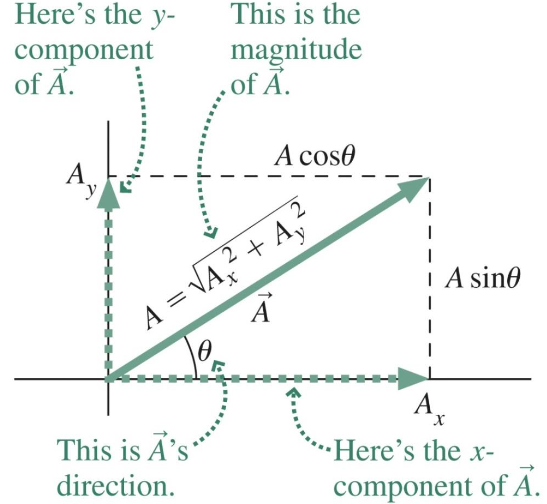
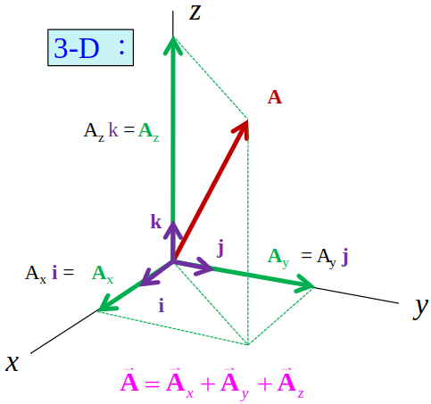

# 在二維與三維運動

---

## 3.1 Vectors(向量)

A Vector can be represented by an arrow whose length corresponds to the Vector's magnitude.
`一個向量可以用一個箭頭來表示，它的長度對應於向量的大小。`
> **Position(位置)**：Position is a Vector quantity. `位置是一個向量`

### Vector Arithmetic(向量計算)

* Vector Addition(向量加法)
  

$$ \vec{r_2}=\vec{r_1}+\Delta\vec{r} $$

* Vector subtract(向量減法)
$$ \vec{A}-\vec{B}=\vec{A}+{(-\vec{B})} $$

### 向量乘除純量

* For a positive scalar the direction is unchanged.
`正向量乘正純量向量不改方向`
* For a negative scalar the direction reverses.
`正向量乘負向量向量改方向`

### Unit Vectors(單位向量)

* **計算**
已知$\vec{A}$為一向量，$|\bar{A}|$則為向量的長度，則該向量的單位向量為：
$$ \hat{A}=\frac{\vec{A}}{|\bar{A}|} $$
* 常用單位向量
  | 向量        | 說明        |
  | ----------- | ----------- |
  | $ \hat{i} $ | 表示x軸向量 |
  | $ \hat{j} $ | 表示y軸向量 |
  | $ \hat{k} $ | 表示z軸向量 |
* 二維向量表示
$$ \vec{A}=\vec{A_x}+\vec{A_y}={A_x}\hat{i}+{A_y}\hat{j} $$

* 三維向量表示
$$ \vec{A}=\vec{A_x}+\vec{A_y}+\vec{A_z}={A_x}\hat{i}+{A_y}\hat{j}+{A_z}\hat{k} $$

### Vector Components(向量分量)

* 二維平面
  
$$
\begin{cases}
  \vec{A_x}\text{是}\vec{A}\text{的x分量} \\
  \vec{A_y}\text{是}\vec{A}\text{的y分量} \\
\end{cases} \rightarrow \vec{A}=\vec{A_x}+\vec{A_y} \\
\begin{cases}
  {A_x}=|\vec{A_x}|=A\cos\theta \\
  {A_y}=|\vec{A_y}|=A\sin\theta \\
\end{cases}
\rightarrow A=\sqrt{{A_x}^2+{A_y}^2} \\
\tan\theta=\frac{A_y}{A_x} \rightarrow \theta=\tan^{-1}\frac{A_y}{A_x}
$$

* 三維平面
  
$$
  \begin{split}
    \vec{A}=&\vec{A_x}+\vec{A_y}+\vec{A_z} \\ =&{A_x}\hat{i}+{A_y}\hat{j}+{A_z}\hat{k} \\
    A=&|\vec{A}|=\sqrt{\vec{A_x}+\vec{A_y}+\vec{A_z}}
  \end{split}
$$

### 使用單位向量進行向量計算

* $ \vec{A}={A_x}\hat{i}+{A_y}\hat{j} $, $ \vec{B}={B_x}\hat{i}+{B_y}\hat{j} $

  >then
  >$$ \vec{A}+\vec{B}=({A_x}+{B_x})\hat{i}+({A_y}+{B_y})\hat{j} $$

#### 例題3.1 Taking a Drive

You drive to a city 160km from home, going $ 35^{\circ} $ N or E
Express your new your position in Unit Vector notation, using an E-W / N-S coordinate system.
`你開車到離家 160 公里的城市，行駛35度 N 或 E，使用 E-W / N-S 坐標係以單位向量表示法表達您的新位置。`
>$$
>\vec{r}={r_x}\hat{i}+{r_y}\hat{j}
> \begin{cases}
  > {r_x}=r\cos \theta=160_{(Km)}\times \cos 35^{\circ}=131_{(km)} \\
  > {r_y}=r\sin \theta=160_{(Km)}\times \sin 35^{\circ}=92_{(km)}
> \end{cases}
> \\
> \therefore \text{The position of the City is }\vec{r}=131\hat{i}+92\hat{j}
> $$

---

## 3.2 Velocity and Acceleration Vectors(速度與加速度向量)

* **Velocity** is the rate of change of Position.
`速度是位置變化的速率`
  * The **average velocity** over a time interval $ \Delta t $ is the change in the position vector $\Delta\vec{r}$ divided by the time interval $\Delta t$.
  `在某段時間內的平均速度是位置向量的變化(位移)除以時間的變化量`
  $$ \bar{\vec{\rm v}}=\frac{\Delta\vec{r}}{\Delta t} $$
  * **Instantaneous velocity** is the time derivative of position:
  `瞬間速度是位置和時間的導函數`
  $$ \vec{\rm v}=\lim_{\Delta t\to 0}\frac{\Delta\vec{r}}{\Delta t}=\frac{\partial\vec{r}}{\partial t} $$
* **Acceleration** is the rate of change of velocity.
`加速度是速度變化的速率`
  * 平均加速度
  $$ \bar{\vec{a}}=\frac{\Delta\vec{v}}{\Delta t} $$
  * (瞬間)加速度
  $$ \vec{a}=\frac{\partial\vec{v}}{\partial t} $$

### Velocity and Acceleration in Two Dimensions(在二維的速度和加速度)

* An acceleration $\vec{a}$ acting for time $\Delta t$ produces a velocity change.
`加速度作用於時間時會產生速度的變化`
$$ \Delta\vec{v}=\vec{a}\Delta t $$

---

## 3.3 Relative Motion(相對運動)

* Motion is Relative $\rightarrow$ requires frame of reference
  `基於參考系統，運動是相對的`
* An object moves with velocity $\vec{v'}$ relative to the first frame of reference.
  `某物體以相對於第一參考系的速度v'移動`
* The first frame moves at $\vec{V}$ relative to the second reference frame.
  `第一參考系的物品相對於第二參考系的速度為V`
* Then the velocity of the object relative to the second frame is $ \vec{v}=\vec{v'}+\vec{V} $
  `那麼物體相對於第一參考系的速度為v=v'+V`

## 3.4 Constant Acceleration(等加速度)

### 等加速度方程式

* With constant acceleration, the equations for one dimensional motion apply independently in each direction.
`在恆定加速度的情況下，一維運動的方程在每個方向上獨立應用。`
* When motion in two or three dimensions each motion equation stands for 2D or 3D separate equations.
`當在二維或三維中運動時，每個運動方程代表 2D 或 3D 單獨的分量。`
$$ \vec{v}=\vec{v}_0+\vec{a}t $$
* For example, in two dimensions, the x and y-components of the position vector $\vec{r}$can be written as:
`例如，在二維中，位置向量r 的 x 和 y 分量可以寫成：`
$$
\vec{r}=\vec{r}_0+\vec{v}_0+\frac{1}{2}\vec{a}t^2 \Rightarrow
\begin{cases}
  x=x_0+v_{x0}t+\frac{1}{2}a_xt^2 \\
  y=y_0+v_{y0}y+\frac{1}{2}a_yt^2
\end{cases}
$$

### 自由落體

$$ y=y_0-\frac{1}{2}gt^2 $$
