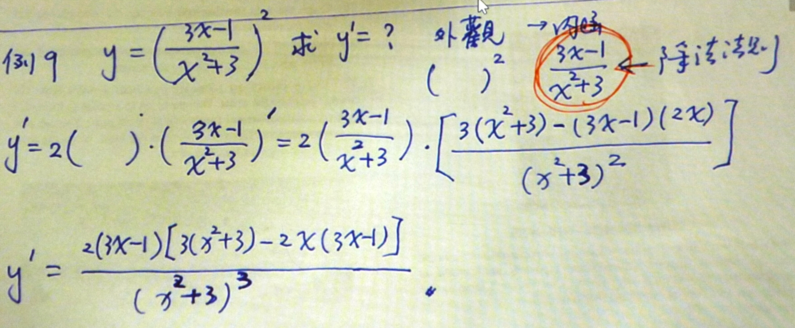

# 2.4連鎖規則

* $ y={(x^2+x+10)}^5 $，求$y=?$
  > $$
  > Basic Rule+\text{(四則運算)}
  > \begin{cases}
    > (x^n)^1=nx^{n-1} \\
    > (\sin x)^1=\cos x
  > \end{cases}
  > $$

---

## 合成函數

* 合成函數-1
$$
  \begin{cases}
    f(x)=\frac{1}{x} \\
    g(x)=x+1
  \end{cases}
  \rightarrow
    f(g(x))=\frac{1}{x+1}
$$
* 合成函數-2
  $$
  \begin{cases}
    f(x)=\sin x \\
    g(x)=2x
  \end{cases}
  \rightarrow f(g(x))=\sin (2x)
  $$
    > 解題步驟：Chain Rule $\rightarrow$找合成的函數

---

### 例題2：合成函數的分解

設$ g(x)=u $
$$
\begin{array}{cc}
    f(g(x)) &\rightarrow u=g(x) &\rightarrow f(u) \\
    \hline \\
    y=\sin 2x &\rightarrow u=2x &\rightarrow y=\sin u
\end{array}
$$

---

### 例題3：應用連鎖規則

$ y=(x^2+1)^3 $，求$\frac{\partial y}{\partial x}=?$
> 解題步驟：
>
> * 先微外觀$\Longrightarrow$再微內涵
> $$
> \begin{array}{cc}
>    f(u) & u \\
>    \hline \\
>    (u)^3 & x^2+1 \\
> \end{array}
> $$
>
> 令：$ u=x^2+1 \Rightarrow y=(u)^3 $
>
>>
>> $$
>> \begin{split}
    >> \frac{\partial y}{\partial x}=& 3u^2(2x+0) \\
    >> =& 3(x^2+1)^2(2x) \\
    >> =& 6x(x^2+1)^2
>> \end{split}
>> $$

---

### 例題8：化簡商的導函數

$$ f(x)=\frac{x}{^3\sqrt{2x^2+4}} $$

---

### 例題9：化簡指數形式的導函數

---

## 總結：連鎖規則 $ \longleftrightarrow $ 合成函數

* $ \frac{\partial}{\partial t}{[f(g)]}=f' \times g' $
  > 令$ u=g(x) $
  > $$
  > \begin{split}
    > \frac{\partial}{\partial x}{[f(g(x))]}=& \frac{\partial}{\partial x}{[f(u)]} \\
    > =& \frac{\partial f}{\partial u}\times \frac{\partial u}{\partial x}
  >\end{split}
  > $$

---

* 習題 4～25

---

## 連鎖規則的順序

1. 基本微分規則
   1. 先微外觀
   2. 再微內涵
2. 四則運算

---

### 例題20

求$ h'(x)=? $
$$ h(x)=\sin(2x)\cos(2x) $$

> * 解題步驟
>   1. 基本函數
>     $$
>     \begin{array}{cc}
>       \sin x & \cos x \\
>       \hline
>       \cos x & -\sin x
>     \end{array}
>     $$
>   2. 乘法規則
>     $$ (f\times g)'=f'g+fg' $$
>   3. 連鎖規則
>   * 外：$ \sin \rm or \cos $
>   * 內：$ 2x $

$$
h'(x)=(2\cos 2x\times \sin 2x)+[2(-\sin 2x)\times \cos 2x ] \\
=2\cos 2x()
$$
<!--這題先擺著-->