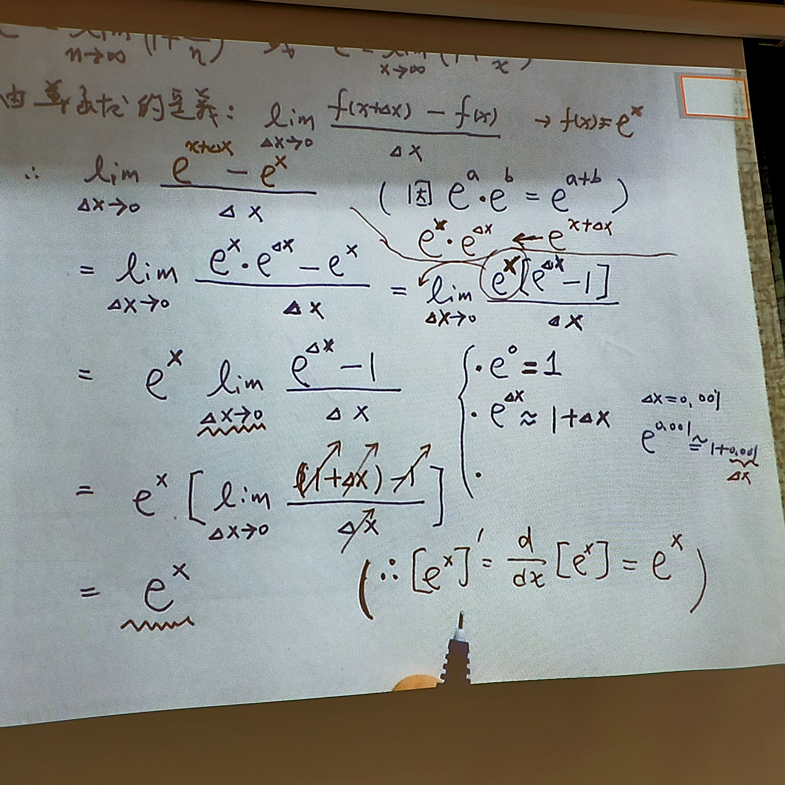

# 5.4 自然指數函數

---

* 阿瑞尼斯方程

  $$ k = A e^{\frac{-E_a}{RT}} $$

  $$ \ln k = -\frac{E_a}{RT}+\ln A $$

* 自然指數 $e$
  * 定義
    源自於本利數

    $$ e=\lim_{n\to \infty}(1+\frac{1}{n})^n $$

  * 結論
    本利數極限為多少？

    $$
    \begin{split}
        A=&\lim_{n\to \infty}\rho (1+\frac{r}{n}) \\
        =&\rho \lim_{n\to \infty}[(1+\frac{1}{\dfrac{r}{n}})] \\
        =&\rho [\lim_{n\to \infty}(1+\frac{r}{n})] \\
        =&\rho e^r
    \end{split}
    $$

* $e$ 的導函數

  $$ [e^x]'=\frac{\partial}{\partial x}[e^x]=? $$

  $$ e=\lim_{n\to \infty}(1+\frac{1}{n})^n \quad or \quad e^x=\lim_{n\to \infty}(1+\frac{x}{n})^n $$

  > 由導函數定義
  >
  > $$ \lim_{\Delta x\to 0}=\frac{f(x+\Delta x)-f(x)}{\Delta x} \to f(x)=e^x $$
  >
  > $$
  > \begin{split}
  > \therefore\lim_{\Delta x\to 0}\frac{e^{x+\Delta x}-e^x}{\Delta x}=&\lim_{\Delta x\to 0}\frac{e^x\times e^{\Delta x}-e^x}{\Delta x} \\
    > =&e^x\lim_{\Delta x\to 0}\frac{e^{\Delta x}-1}{\Delta x} \\
    > =&e^x[\lim_{\Delta x\to 0}\frac{(1+\Delta x)-1}{\Delta x}] \\
    > =&e^x
  > \end{split}
  > $$

  $$
  \therefore [e^x]'=\frac{\partial}{\partial x}[e^x]=e^x
  $$

  

---

## 總結

* 自然指數函數(natural exponential function)
  * 符號 $e^x$
  * 導函數 $e^x$
  * 特性 $e^0=1$
    $$
    \begin{cases}
      e^a\times e^b=e^{a+b} \\
      \dfrac{e^a}{e^b}=e^{a-b}
    \end{cases}
    $$
