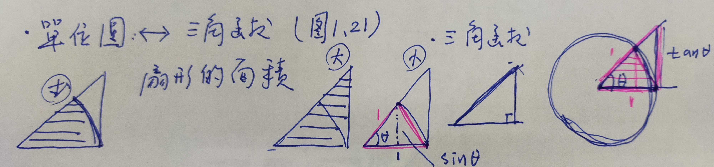
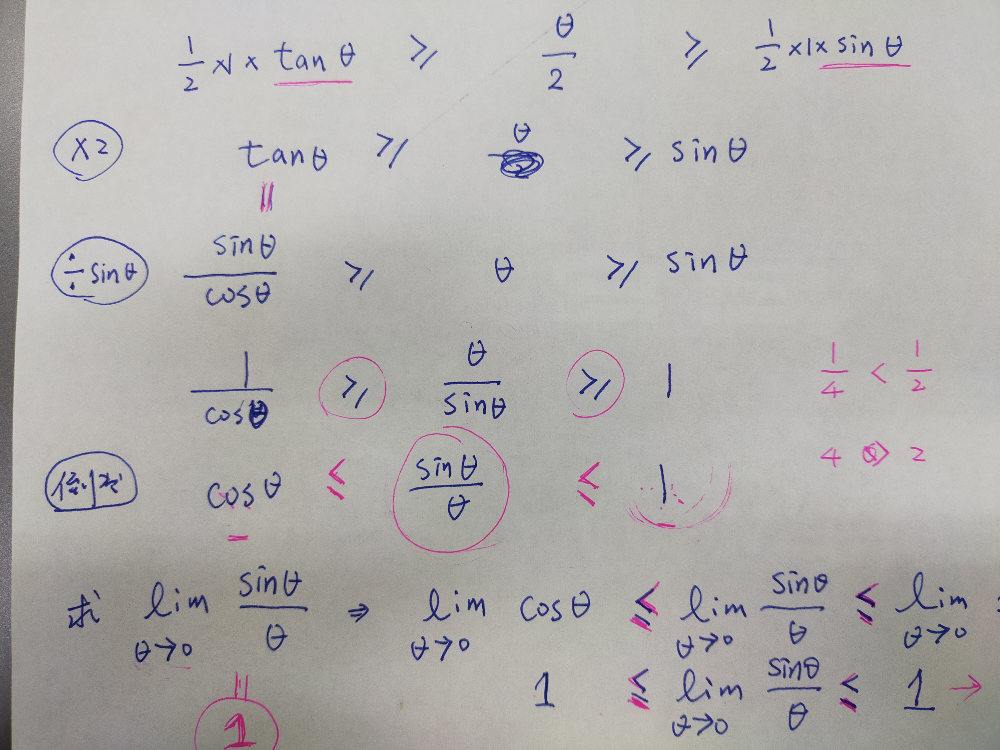

# 夾擠定理

---

$$ \lim_{x\to 0}\frac{\sin x}{x} $$

* 代入$ x=0 $
$$ \frac{\sin 0}{0}\to \text{不定型} \to \text{羅必達規則(微分、導函數)} $$

* 使用單位圓 $ \iff $ 三角函數

$$ \text{大三角形的面積}\geq \text{扇形面積}\geq \text{小三角面積} $$ $$  $$

---

## 例題9

$$ \lim_{x\to 0}\frac{\tan x}{x} $$

* 因為
$$ \tan x=\frac{\sin x}{\cos x} $$
* 故可得
$$ \lim_{x\to 0}=\frac{\frac{\sin x}{\cos x}}{x}=\lim_{x\to 0}\frac{1\times \sin x}{{\cos x}\times x}=\lim_{x\to 0}\frac{1}{\cos x}=\lim_{x\to 0} $$
<!-- 此處待補充 -->
---

## 例題10

藉由 $$ \lim_{x\to 0}=\frac{\sin x}{x}=1 $$
推導 $$\lim_{x\to}\frac{\sin 4x}{x} $$

1. 直接代入$ x=0 $
$$ \frac{\sin 0}{0}=\frac{0}{0}\to \text{不定型} $$
2. 由$$ \lim_{x\to 0}\frac{\sin x}{x}=1 $$ (分子/分母具有同相)
$$ \lim_{x\to 0}\frac{\sin 4x}{x}=\lim_{x\to 0}\frac{4\sin 4x}{4x}=4 $$

* **問題1.3**
* 28題
$$ \lim_{x\to 0}\frac{\sin x}{5x}=\frac{1}{5}\lim_{x\to 0}\frac{\sin x}{x}=\frac{1}{5} $$
* 33題
$$ \lim_{t\to 0}\frac{\sin 3t}{2t}=\frac{1}{2}\lim_{t\to 0}\frac{\sin 3t}{t}=\frac{1}{2}\lim_{t\to 0}\frac{3\sin 3t}{3t}=\frac{3}{2}\lim_{x\to 0}\frac{\sin 3t}{3t}=\frac{3}{2} $$

---
