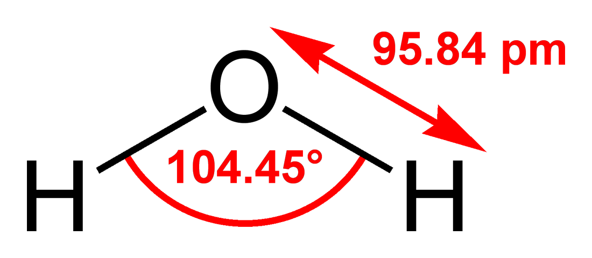

# Atom, Molecules, and Ions

---

## 原子(Atom)

>Nucleus contain protons and neutrons protons have a positive charge equel in magnitude to the electron's ($ e^{-}$ 's) negative charge.
Neutrons have the same mass as a protons but no charge.
<!--
原子核內包含質子和中子，質子具有正電荷，其大小與電子的負電荷相等 
中子擁有和質子差不多的質量，但中子不帶電。
-->
* 註釋
  | 單字 | 中文 |
  | --- | --- |
  | Nucleus | 原子核 |
  | Protons | 質子 |
  | Neutrons | 中子 |
  | Positive | 正電的 |
  | Negative | 負電的 |

* 質子電子中子的重量
  $ e^{-}={8.11\times 10^{-31}}_{(Kg)} $
  $ P^{+}={1.6726\times 10^{-27}}_{(Kg)} $
  $ n ={1.6749\times 10^{-27}}_{(Kg)} $

---

## 分子(Molecules)

>When molecules formed the forces that hold atoms together is called chemical bond.
By sharing $ e^{-} $s, these bond are called cavalent bonds.

* Ex: $CO_2$ (Chemical formula)
  $$ O=C=O $$
* Ex: $ H_2O $
  

* 註釋
  | 單字 | 中文 |
  | --- | --- |
  | Chemical bond | 化學鍵 |
  | Cavalent bonds | 共價鍵 |

---

## 離子(Ions)

* Ex: $NaCl$
$$ Na\to Na^++e^- $$ $$ Cl+e^-\to Cl^- $$

---

## 化合物的命名(Noming Simple compound)

* Ionic compound
  * $ NaCl $,$ KI $ _(type A)_
   1. The cation is always named first, and the anion second.

   2. A monatomic cation takes its name form the name of the element
        >Ex: $ Na^+ $ is solium
   3. A monatomic anion is named by taking the first part of the element name and adding "ide"
        >Ex: $Cl^- $ is chloride
  * $ FeCl_2 $ and $ FeCl_3 $ _(type B)_
    When the metal form only two ions.
    <!-- 這邊沒寫完，待補充 -->
    * The prefix, mono is never uaed for naming the first element.
      >$N_2O$: Dinitrogen monoxide
      $NO$: Nitrogen monoxide
  * acid
    1. If the anion does not contain oxygen, the acid is named with the prefix "hydro—" and suffix "—ic"
        >Ex: $HF:hydroflucric$ acid
    2. containing oxygen
      Small number of oxygen is "—ous", large number of oxygen is "—ic".
        >HNO_3: nitric acid
        HNO_2: nitrous acid
