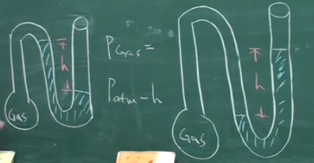
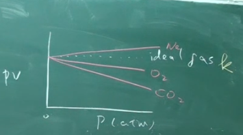
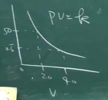
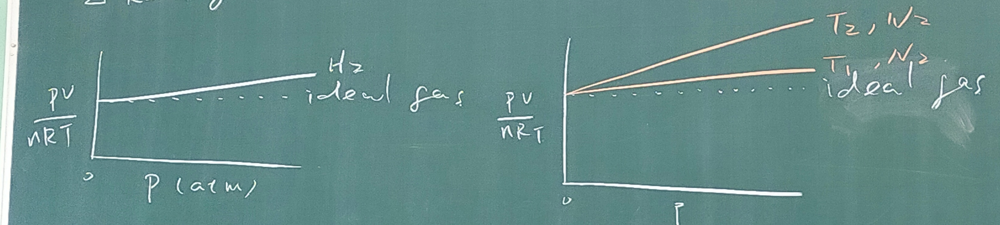

# Ch4.Gases(氣體)

---

## Early Experiments(早期實驗)

* In 1643, Torricelli showed that the air in the atmosphere exerts pressure.
  `托里切利表明，大氣中的空氣會施加壓力。`
* The pressure unit is millmeters of mercury (mm-Hg) is called the "torr" in honor of Torricelli.
`壓力單位是毫米汞柱(mm-Hg)被稱為“torr”以紀念托爾切利。`

---

## ideal gas(理想氣體)

The ideal gas is the behaviour of real gas approaching at low pressures and high temperature.
`理想氣體是真實氣體在高溫低壓下的行為。`

1. **Boyle's law(波以爾定律)**
   A gas that obeys Boyle's law is called an ideal gas.
   `如果有一個氣體符合波以爾定律，則那個氣體被稱作理想氣體`

   $$ PV=k $$

   > k: constant as a specific temperature for a given gas sample`已知氣體樣品的恆定溫度`
   > T, n: constant`恆定的`

2. **Charles's law(查理定律)**
   The volume of a gas at constant pressure increases linearly with temperature of gas.
   `恆定壓力下的氣體體積與氣體溫度成正比。`

   $$ v=bT $$

   > T: kelvin temperature `克耳文溫標`
   > b: constant `恆定值`
   > $P_1$ 、n is constant `壓力和莫爾數為恆定值`

3. **Avogadro's law(亞佛加厥定律)**
   Equal volumes of gases at the same temperature and pressure contain the same number of "particles"
  `同體積的氣體在同溫同壓下含有相同的粒子數`

   $$ v=an $$

   > v: volume `體積`
   > n: mole `莫爾數`
   > $T_1$ 、P is constant `溫度和壓力為恆定值`

---

## ideal gas law(理想氣體定律)

$$ PV=nRT $$

### Standard Temperature and Pressure(標準狀態STP)

在STP下， $T=0^{\circ}C=273.15K$ ， $P=1_{(atm)}$ ， $V=1_{(L)}$

$$ \frac{1\times 0.082 \times 273}{1}=22.42_{(L)} $$

---

## Dalton's law of Partial Pressure(道耳頓分壓定律)

For a mixture od gases in a container, the total pressure exerted is the sum of the pressure that each gas would exert if it were alone.
`對混合氣體來說，在一個容器裡面的總壓為個別氣體的總和`

$$ P_{total}=P_1+P_2+P_3... $$

### Mole Fraction(莫爾分率)

$$ X_1=\frac{n_1}{n_{total}}=\frac{n_1}{n_1+n_2+n_3...} $$

#### 例題

The mixture of $CH_4$ and $O_2$，$P_{CH_4}=0.175(atm)$，$ P_{O_2}=0.250(atm) $
`有一CH4和O2的混合物，甲烷的壓力=0.175(atm)，氧氣的壓力=0.250(atm)`

1. What is the mole fraction of each gas.
   `每種氣體的莫耳分率是多少。`
2. If the mixture occupies $10.5(L)$ at $65^{\circ}C$, calculato $n_{total}$ .
   `如果混合物在65度下佔10.5(L)，計算總莫耳數。`
3. Calculato the number of grams of each gas in the mixture.
   `計算混合物中每種氣體的克數`

> $Sol:$
>
> 1. What is the mole fraction of each gas?
> `每種氣體的莫耳分率有多少?`
>
> $$ X_{CH_4}=\frac{P_{CH_4}}{P_{total}}=\frac{0.175}{0.175+0.25}(atm)=0.412_{(atm)} $$
>
> $$ X_{O_2}=1-X_{CH_4}=0.588_{(atm)} $$
>
> 2. If the mixture occupies $10.5(L)$ at $65^{\circ}C$, calculato $n_{total}$.
>
> $$ n_{total}=\frac{P_{total}V}{RT}=\frac{0.425\times 10.5}{0.082\times 338}=0.161_{(mol)} $$
>
> 3. Calculato the number of grams of each gas in the mixture.
>
> $$ n_{CH_4}:X_{CH_4}\times n_{total}=0.412\times 0.161= 6.63\times 10^{-2}mol $$
>
> $$ \therefore W_{CH_4}=n_{CH_4}\times 16=1.06_{(g)} $$
>
> $$ n_{O_2}=0.588\times 0.161=9.46\times {10^{-2}}_{(mol)} $$
>
> $$ \therefore n_{O_2}\times 32=3.02_{(g)} $$

### 名詞釋義

| 中文   | 英文    |
| ------ | ------- |
| 混合物 | mixture |

---

## kinetic molecular theary(分子動力學)

kinetic molecular theary is a simple model to explain the properties of an ideal gas.
`分子動力學是解釋理想氣體性質的簡單模型。`

* The particles are so small compared with the distamces between them that the volume of the individual particles can be assumed to be negligible.
`與它們之間的距離相比，這些粒子是如此之小，以至於可以假設單個粒子的體積可以忽略不計。`

* The particles are in constant motion. The collisions of the particles with the walls of the container are the cause of the pressure exerted by the gas.
`粒子的運動持續不斷，氣體分子不斷撞擊器壁是造成氣壓的原因。`

* The particles are assumed to neither attract nor repel each other.
`粒子被假設不吸引也不排斥`

* The average kinetic energy of collection of gas particles is assumed to be directly proportional to the kelvin temperature of the gas.
`氣體粒子的擁有的平均動能與氣體的克氏溫度成正比`
`proportional:正比`

$$ \therefore E_k\propto T $$

---

### $ E_k\propto T $

<!-- 之後再寫，這邊內容有點多 -->

### Root Mean square velocity(均方根速率)

* $\bar{u}^2:\text{the average of the square velocity}$
* $u_{rms}=\sqrt{\bar{u}^2}:\text{root mean square velocity}$

$$
K_E=N_A(\frac{1}{2}m\bar{u}^2)=\frac{3}{2}RT \\
\Rightarrow\bar{u}^2=\frac{3RT}{mN_A} \\
\Rightarrow u_{rms}=\sqrt{\bar{u}^2}=\sqrt{\frac{3RT}{mN_A}}
$$

* $u_{mp}:\text{most probable velocity}$
  > The most probable velocity mean the velocity possessed by the greatest number of gas particle.

  $$ u_{mp}=\sqrt{\frac{2k_sT}{m}}=\sqrt{\frac{2RT}{mV_A}} $$
  >
  > $m$ :A gas particle mass
  > $k_B$ :Boltzmann's constant
  > $k_B=1.38\times 10^{-23}$
<!-- 待補 -->

---

## Real gas(真實氣體)

* 左圖：Low Pressure(P) to ideal gas.
* 右圖：High Temperature(Temp.) approach to ideal gas.

### 凡得瓦方程式

$$ (P_{obs}+a(\frac{n}{V})^2)(V-nb)=nRT $$

  > $ (P_{obs}+a(\frac{n}{V})^2) $: Corrected pressure(ideal as attract)
  > $ (V-nb) $: Corrected volume(ideal gas don't have volume)
