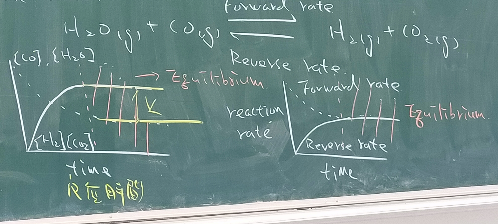

# Ch6.Chemical Equilibrium(化學平衡)

* 概論
The state in which the concentrations of all reactants and products remain constant with time.
  > remain constant: 不變

  $$ H_2O_{(g)}+CO_{(g)}\rightleftharpoons {H_2}_{(g)}+{CO_2}_{(g)} $$
    
When equilibrium, $$ k=\frac{{[H_2]}{[CO_2]}}{{[H_2O]}{[CO]}} $$
    > ${[H_2]}, {[CO_2]}, {[H_2O]}, {[CO]} $ indicates the equilibrium position.

---
